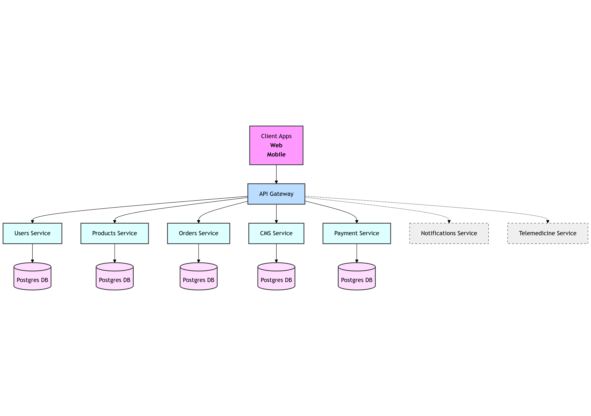

# ChemistKe

[](https://go.dev/)
[](https://www.docker.com/)
[]()
[](LICENSE)
[]()
[](https://grpc.io/)

---

It provides a robust backend system that can handle:
- User management
- Product management
- Order processing
- Content management (CMS)
- Secure API Gateway communication
- (Upcoming) Payment processing
- (Upcoming) Notification service
- (Upcoming) Telemedicine services

---

## Microservices Overview

ChemistKe is composed of the following microservices:

- **User Service** — manages user registration, authentication, and profiles.
- **Product Service** — handles pharmaceutical products and inventory.
- **Order Service** — processes customer orders and order history.
- **CMS Service** — manages blog content, banners, and marketing materials.
- **API Gateway** — acts as a single entry point to all internal services.
- **Payment Service** — _(in progress)_ — handles transactions and payment gateways.
- **Notification Service** — _(in progress)_ — handles email, SMS, and push notifications.
- **Telemedicine Service** — _(in progress)_ — allows remote consultations with pharmacists/doctors.

---

## Technologies Used

- **Go (Golang)** — main backend language
- **gRPC** — communication between services
- **PostgreSQL** — primary database
- **Docker / Docker Compose** — containerization and orchestration
- **Make** — simple build automation
- **Protobuf** — gRPC contract definitions

---

## Architecture Overview
<!-- image from ./public/images/architecture.png -->


All services communicate **internally** using **gRPC** and are orchestrated with **Docker Compose**.
Only the **Gateway** is exposed to the outside world.

---

## Installation & Setup

### 1. Prerequisites

Make sure you have installed:

- [Docker](https://docs.docker.com/get-docker/)
- [Docker Compose](https://docs.docker.com/compose/install/)
- [Go 1.22+](https://go.dev/dl/)
- [Make](https://www.gnu.org/software/make/)

Optional (for development):
- [Protobuf Compiler](https://grpc.io/docs/protoc-installation/)
- [Goose](https://github.com/pressly/goose) for database migrations

---

### 2. Clone the Repository

```bash
git clone https://github.com/kelcheone/chemistke.git
cd chemistke
```

---

### 3. Environment Variables

Create a `.env.docker` file at the root.

You can copy from the provided sample:

```bash
cp .env.example .env.docker
```

Edit `.env.docker` to match your local configuration (especially database credentials and JWT secret).

---

### 4. Building and Running with Docker Compose

#### Microservices mode:

```bash
docker compose -f docker-compose.microservices.yml up --build
```

This will:

- Build all services
- Start the database
- Apply database migrations
- Start the API Gateway and services

**Note**: The API Gateway will be available at `http://localhost:9090`.

---

#### Monolith mode (for simple deployment):

```bash
docker compose -f docker-compose.monolith.yml up --build
```

This runs the full application as a single binary (instead of multiple services).

---

### 5. Database Migrations (Manual)

If you want to run database migrations manually:

```bash
make db-up
```

This uses `goose` under the hood.

---

## Testing

Each service has its own unit and integration tests (in progress).

To run tests:

```bash
go test ./...
```

Inside the service folder.

---

## Project Structure

```plaintext
/cmd               -> Entrypoints for each microservice
/internal
  /database        -> Migrations, database connections
  /grpc            -> gRPC handlers
  /models          -> Data models
  /services        -> Business logic
/proto             -> Protobuf files for gRPC
/deployment/docker -> Dockerfiles for each service
/deployment/make   -> Make commands
```

---

## Roadmap

- [x] User Management
- [x] Product Catalog
- [x] Orders Management
- [x] CMS Management
- [ ] Payment Gateway Integration
- [ ] Notification System
- [ ] Telemedicine Platform
- [ ] Admin Panel Frontend

---

## Contributing

We welcome contributions!
To contribute:

1. Fork the repository
2. Create a feature branch
3. Push your changes
4. Open a Pull Request

---

## Maintainer

- [KelcheOne](https://github.com/kelcheone)

---

## 📜 License

This project is licensed under the [MIT License](LICENSE).

---
